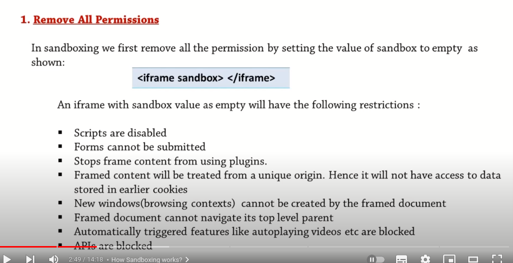

- it will record either the tab or the entire screen

- you can add `html` & `js` elements to the web accessible resources

---

- iframe element :
  https://www.youtube.com/watch?v=Zj3nUbLpqn4

  - inside the iframe you can add a website or a static html file
    in your file directory
  - some websites block the usage of their url in iframe

  🔸 allow attribute : sandboxing iframes help to apply certain restrictions to the content of the iframe to prevent it from malicious attacks

  - adding the attribute `sandbox` will apply all the restrictions

    -  having same orging means that it has same (url, port number, hostname)
    
